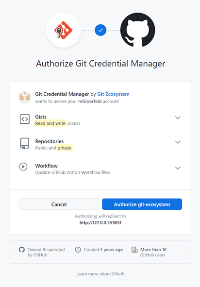

# :a: Hamilton App

This project was generated with [Angular CLI](https://github.com/angular/angular-cli) version 18.2.0.  

> [!NOTE]
> You may need these requierems for fine working app!  
> Make sure your system and dependencies match these settings.
>
> - [x] Server Side Rendering _(SSR)_
> - [x] Static Site Generation _(SSG)_
> - [x] i18n _(de, en, fr, ...)_
> - [x] AppShell
> - [x] Tailwind CSS

## How to use

> [!IMPORTANT]
> You may need these requierems for fine working app!  
> Make sure your system and dependencies match these settings.
>
> - [x] Node.js _>=v22.6.0_
> - [x] npm _>=10.8.2_
> - [x] Angular CLI _>=18.2.0_

First of all check out the repo to your computer and make sure you have installed the latest angular CLI. If not run `npm install -g @angular/cli `.
Switch into the project folder and run `npm install`. After a few miniutes npm sould completed installation of a dependencies.

## Development server

Run `ng serve` for a dev server. Navigate to `http://localhost:4200/`. The application will automatically reload if you change any of the source files.

## Production builds

Run `ng build --configuration=production` to generate a production build with SSR _(Server-side rendering)_, SSG _(Static Site Generation)_, and AppShell support.
